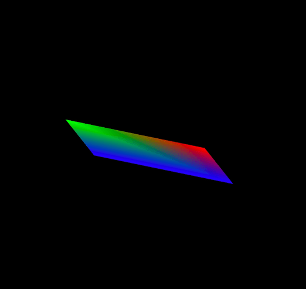

最近刚好在上「计算机图形学」的课程，有机会接触到openGL的学习，openGL是一个定义了函数布局和输出的图形API的正式规范，学习openGL能对3D编程有一个很好的初步了解。

**Content**
[TOC]

### 学习openGL你将需要知道
* 基本的线性代数知识（尤其是关于矩阵、向量）
* C++常规编程

### demo代码
主程序`main.cpp`
```c++
#define GLEW_STATIC
#include<GL/glew.h>

#include<GLFW/glfw3.h>

#include<iostream>
#include <cmath>

#include "shader.h"

#include "glm/glm.hpp"
#include "glm/gtc/matrix_transform.hpp"
#include "glm/gtc/type_ptr.hpp"
using namespace std;

//设置窗口大小
const GLfloat WIDTH = 600, HEIGHT = 600;

int main()
{
    glfwInit();//glfw初始化
    //glfwWindowHint部分：设置一些关于窗口的选项，在进行绘制前的基本设置
    glfwWindowHint(GLFW_CONTEXT_VERSION_MAJOR, 3);// 设置OpenGL主版本号，使用版本为3以后的，所以参数设为3
    glfwWindowHint(GLFW_CONTEXT_VERSION_MINOR, 3);// 设置OpenGL副版本号
    glfwWindowHint(GLFW_OPENGL_PROFILE, GLFW_OPENGL_CORE_PROFILE);// OpenGL模式，第二个参数表示核心模式
    glfwWindowHint(GLFW_OPENGL_FORWARD_COMPAT, GL_TRUE);// for mac
    glfwWindowHint(GLFW_RESIZABLE, GL_FALSE);// 窗口是否可调整大小，第二个参数表示不允许改变窗口大小
    // 创建窗口对象
    GLFWwindow *window = glfwCreateWindow(WIDTH, HEIGHT, "texture B16040517", nullptr, nullptr);
    int screenWidth, screenHeight;
    //读取窗口实际上的缓存空间，得到实际大小
    glfwGetFramebufferSize(window, &screenWidth, &screenHeight);
    //判断窗口是否创建成功
    if (nullptr == window)
    {
        std::cout << "Failed to create GLFW window" << std::endl;
        glfwTerminate();
        return -1;
    }
    //设置当前绘制窗口
    glfwMakeContextCurrent(window);
    //启动OpenGL并判断启动是否成功
    glewExperimental = GL_TRUE;
    if (GLEW_OK != glewInit())
    {
        std::cout << "Failed to initialise GLEW" << std::endl;
        return -1;
    }
    glViewport(0, 0, screenWidth, screenHeight);//设置视图大小，起点（前两个参数）及视图宽高，默认情况下为占据整个打开窗口的像素矩形
    Shader ourShader = Shader("shader/core.vs", "shader/core.frag");
    
    const GLfloat textureWidth = 500;
    const GLfloat textureHeight = 500;
    const GLfloat texture_xoffset = -250;
    GLfloat texture_xoffset_rate = texture_xoffset/(WIDTH/2);
    GLfloat
    ver_1_x = -texture_xoffset_rate, ver_1_y = (textureWidth/2)/(HEIGHT/2),
    ver_2_x = -texture_xoffset_rate, ver_2_y = -(textureWidth/2)/(HEIGHT/2),
    ver_3_x = -(textureWidth/(WIDTH/2)+texture_xoffset_rate), ver_3_y = -(textureHeight/2)/(HEIGHT/2),
    ver_4_x = -(textureWidth/(WIDTH/2)+texture_xoffset_rate), ver_4_y = (textureHeight/2)/(HEIGHT/2);
    
    
    GLfloat vertices_1[] = {
        //position_1             // colors
        ver_1_x,ver_1_y,0.0f,    1.0f, 0.0f, 0.0f,
        ver_2_x,ver_2_y,0.0f,    0.0f, 1.0f, 0.0f,
        ver_3_x,ver_3_y,0.0f,    0.0f, 0.0f, 1.0f,
        ver_4_x,ver_4_y,0.0f,    0.0f, 0.0f, 1.0f,
    };
    
    unsigned int indices_1[]{ // 索引
        0,1,3, // 第一个三角形
        1,3,2 // 第二个三角形
    };
    
    GLuint VBO[2], VAO[2], EBO[2];//VBO 顶点缓冲对象
    
    glGenVertexArrays(1, &VAO[0]);
    glGenBuffers(1, &VBO[0]);
    glGenBuffers(1, &EBO[0]);
    // 1. 绑定顶点数组对象
    glBindVertexArray(VAO[0]);
    // 2. 把我们的顶点数组复制到一个顶点缓冲中，供OpenGL使用
    glBindBuffer(GL_ARRAY_BUFFER, VBO[0]);
    glBufferData(GL_ARRAY_BUFFER, sizeof(vertices_1), vertices_1, GL_STATIC_DRAW);
    // 3. 复制我们的索引数组到一个索引缓冲中，供OpenGL使用
    glBindBuffer(GL_ELEMENT_ARRAY_BUFFER, EBO[0]);
    glBufferData(GL_ELEMENT_ARRAY_BUFFER, sizeof(indices_1), indices_1, GL_STATIC_DRAW);
    // 4. 设定顶点属性指针
    // position attribute
    glVertexAttribPointer(0, 3, GL_FLOAT, GL_FALSE, 6 * sizeof(float), (void*)0);
    glEnableVertexAttribArray(0);
    // color attribute
    glVertexAttribPointer(1, 3, GL_FLOAT, GL_FALSE, 6 * sizeof(float), (void*)(3 * sizeof(float)));
    glEnableVertexAttribArray(1);
    
    // 定义变换矩阵
    
    
    //判断窗口是否关闭，不关闭继续执行
    while (!glfwWindowShouldClose(window))
    {
        const float color[] = {0.0f, 0.0f, 0.0f, 1.0f};
        glClearColor(color[0], color[1], color[2], color[3]);//R,G,B,Alpha
        glClear(GL_COLOR_BUFFER_BIT);//上色，背景颜色初始化
        
        glm::mat4 transform = glm::mat4(1.0f); // 初始化为单位矩阵
        ourShader.Use();
        transform = glm::rotate(transform, glm::radians(45.0f)*static_cast<GLfloat>(glfwGetTime()), glm::vec3(1.0f,1.0f,1.0f));
        transform = glm::scale(transform, glm::vec3(0.5f,0.5f,0.5f));
        //        transform = glm::rotate(transform, glm::radians(1.0f),glm::vec3(0.0f,0.0f,1.0f));
        //        transform = glm::scale(transform, glm::vec3(0.999f,0.999f,0.999f));
        // 和着色器通讯
        unsigned int transformLoc = glGetUniformLocation(ourShader.Program, "transform");
        glUniformMatrix4fv(transformLoc, 1, GL_FALSE, glm::value_ptr(transform));
        
        glBindVertexArray(VAO[0]); // 绑定**
        glDrawElements(GL_TRIANGLES, 6, GL_UNSIGNED_INT, 0);
        
        glfwSwapBuffers(window);
        glfwPollEvents();
    }
    glDeleteVertexArrays(1, &VAO[0]);
    glDeleteBuffers(1, &VBO[0]);
    
    glfwTerminate();
    return 0;
}

```
着色器类`shader.hpp`
```
#pragma once

#include<string>
#include<fstream>
#include<sstream>
#include<iostream>
#include<GL/glew.h>

class Shader {
    GLuint vertex, fragment;
    
public:
    GLuint Program;
    Shader(const GLchar *vertexPath, const GLchar *fragmentPath) {
        std::string vertexCode;
        std::string fragmentCode;
        std::ifstream vShaderFile;
        std::ifstream fShaderFile;
        
        vShaderFile.exceptions(std::ifstream::badbit);
        fShaderFile.exceptions(std::ifstream::badbit);
        
        try {
            vShaderFile.open(vertexPath);
            fShaderFile.open(fragmentPath);
            
            
            std::stringstream vShaderStream, fShaderStream;
            
            
            
            vShaderStream << vShaderFile.rdbuf();
            fShaderStream << fShaderFile.rdbuf();
            
            vertexCode = vShaderStream.str();
            fragmentCode = fShaderStream.str();
            
        }
        catch (std::ifstream::failure e) {
            std::cout << "ERROR:SHADER::FILE_NOT_SUCCESSFULLY_READ" << std::endl;
        }
        
        
        
        //进行格式转换
        const GLchar *vShaderCode = vertexCode.c_str();
        const GLchar *fShaderCode = fragmentCode.c_str();
        
        // import and compile the shader
        vertex = glCreateShader(GL_VERTEX_SHADER);
        glShaderSource(vertex, 1, &vShaderCode, NULL);	// 加载字符串
        glCompileShader(vertex);	// 编译
        
        // 检查是否编译成功
        GLint success;
        GLchar infoLog[512];
        
        glGetShaderiv(vertex, GL_COMPILE_STATUS, &success);
        if (!success) {
            glGetShaderInfoLog(vertex, 512, NULL, infoLog);
            std::cout << "ERROR::SHADER::VERTEX::COMPILATION_FAILED\n" << infoLog << std::endl;
        }
        
        fragment = glCreateShader(GL_FRAGMENT_SHADER);
        glShaderSource(fragment, 1, &fShaderCode, NULL);	// 加载字符串
        glCompileShader(fragment);	// 编译
        
        // 检查是否编译成功
        glGetShaderiv(fragment, GL_COMPILE_STATUS, &success);
        if (!success) {
            glGetShaderInfoLog(fragment, 512, NULL, infoLog);
            std::cout << "ERROR::SHADER::FRAGMENT::COMPILATION_FAILED\n" << infoLog << std::endl;
        }
        
        // create program and link it
        this->Program = glCreateProgram();
        glAttachShader(this->Program, vertex);	// 把目标文件加入
        glAttachShader(this->Program, fragment);
        glLinkProgram(this->Program);
        
        // 检查链接是否错误
        glGetProgramiv(this->Program, GL_LINK_STATUS, &success);
        if (!success) {
            glGetProgramInfoLog(this->Program, 512, NULL, infoLog);
            std::cout << "ERROR::PROGRAM::FRAGMENT::LINK_FAILED\n" << infoLog << std::endl;
        }
        
        // validate
        
        glValidateProgram(this->Program);
        glGetProgramiv(this->Program, GL_VALIDATE_STATUS, &success);
        if (!success) {
            glGetProgramInfoLog(this->Program, 512, NULL, infoLog);
            std::cout << "ERROR::SHADER::PROGRAM::VALIDATE\n" << infoLog << std::endl;
        }
        
        
    }
    ~Shader() {
        glDetachShader(this->Program, vertex);
        glDetachShader(this->Program, fragment);
        
        glDeleteShader(vertex);
        glDeleteShader(fragment);
        
        glDeleteProgram(this->Program);
    }
    void Use() {
        glUseProgram(this->Program);
    }
    
};
```
顶点着色器`core.vs`
```
#version 330 core
layout (location = 0) in vec3 aPos;
layout (location = 1) in vec3 aColor;
out vec3 ourColor;
uniform mat4 transform;
void main()
{
    gl_Position =  transform*vec4(aPos, 1.0);
    ourColor = aColor;
}
```
片段着色器`core.frag`
```
#version 330 core
out vec4 FragColor;
in vec3 ourColor;
void main()
{
    FragColor = vec4(ourColor,1.0f);
}

```
其他头文件`glew.h glfw.h`等头文件可以google到相应的github页面下载。

### 效果
运行以上代码你将看到的效果是：

<small>围绕法向量(1.0f,1.0f,1.0f)旋转</small>

### 参考资源
[learning openGL中文教程](https://learnopengl-cn.github.io/01%20Getting%20started/09%20Camera/)该教程翻译自[原英文教程](https://learnopengl.com)，整个教程讲解得详细而且专业，不但告诉你如何用代码实现，而且还会从原理剖析。原理讲解不僵硬，生动详细。稍微耐心的阅读教程的讲解，就能理解其中的每一个细节原理。让你知其然并且知其所以然，是一篇很好的教程。
