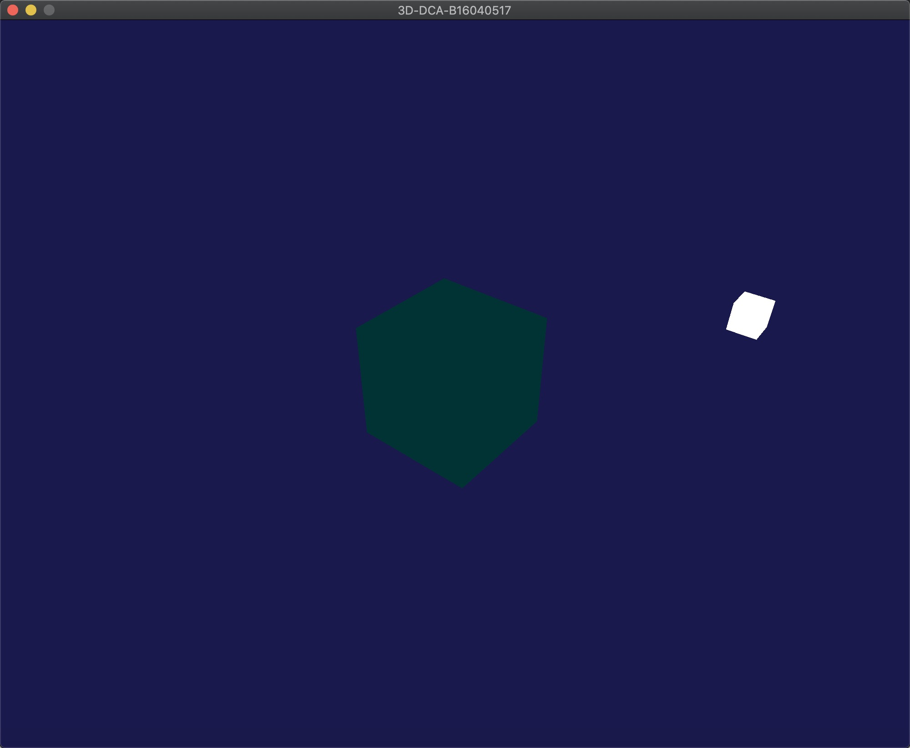
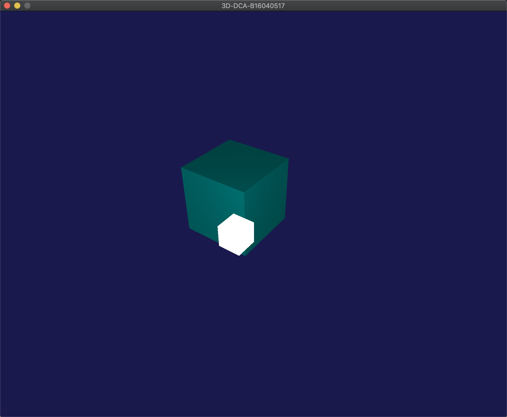
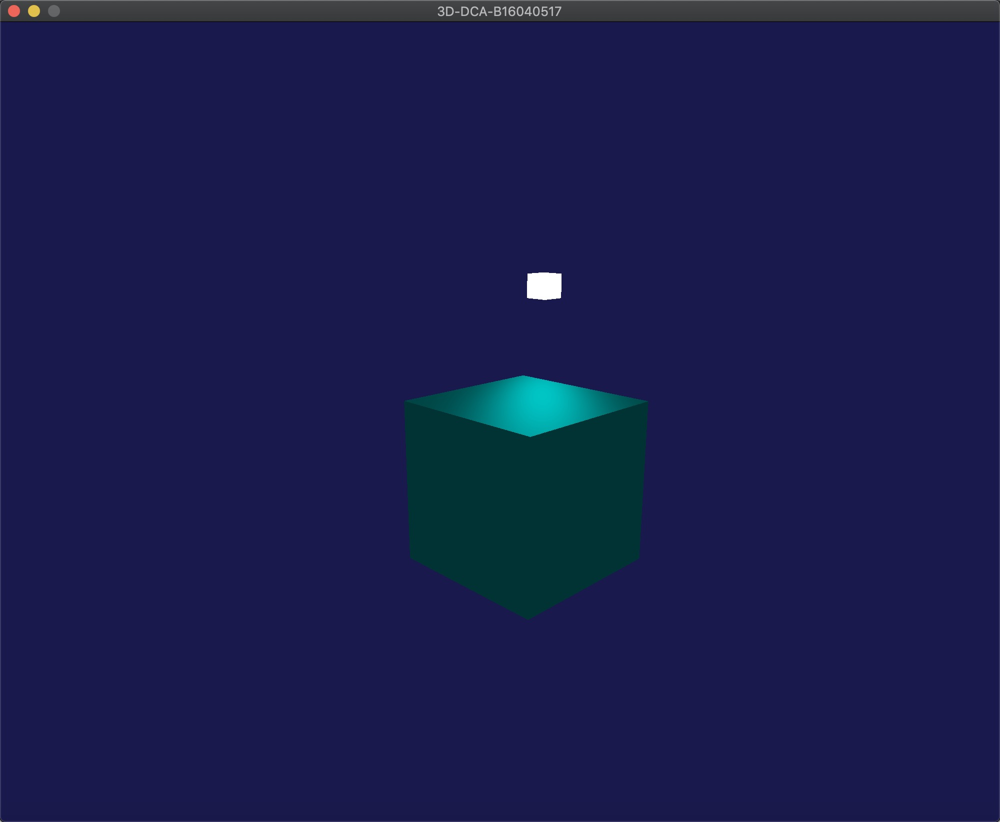

**Content**
[TOC]

### 基本概念
#### 冯氏光照模型(Phong Lighting Model)
主要结构为3个分量组成：
* 环境光(Ambient)
模拟永不消逝的光源，即便是在黑暗的环境下物体也不会是全黑。
* 漫反射光(Diffuse)
模拟光源对物体的方向性的影响，这是冯氏光照模型中最为显著的分量。
* 镜面光(Specular)
模拟有光泽物体上面出现的亮点。镜面光照的颜色相比于物体的颜色会更倾向于光的颜色。

#### 环境光
光线通常都不是来自于一个光源，光能够在其他表面产生反射，为了模拟这一效果，有一个叫做**全局照明（Global Illumination）算法**（比较复杂）。
**环境光照**是简化的**全局照明**。这样子的话即便场景中没有直接的光源也能看起来存在有一些发散的光。
片段着色器看起来可能像这样：
```
void main()
{
    float ambientStrength = 0.1; // 小常数
    vec3 ambient = ambientStrength * lightColor;
    vec3 result = ambient * objectColor;
    FragColor = vec4(result, 1.0);
}
```
现在立方体看起来大概是这样：

这种折射、反射得到的一个**宏观**的结果。

#### 漫反射光照
环境光照本身不能提供有趣的结果，但是**漫反射光照**开始对物体产生显著的影响。
如果光线垂直于物体表面，这束光对物体的影响会最大化（更亮）。照射光线与**法向量**的夹角将会影响这一结果。通过单位向量的点乘可以很容易的计算出这个夹角。
所以计算漫反射夹角需要
* 法向量：一个垂直于顶点表面的向量。
* 定向的光线：作为光源的位置与片段的位置之间向量差的方向向量。为了计算这个光线，我们需要光的位置向量和片段的位置向量（向量相减）。

#### 法向量
计算顶点的法向量：利用顶点周围的点叉乘，来计算顶点的法向量。
简单的法向量我们可以手动的输入，比如这里的构成立方体的36个顶点的法向量(第4、5、6列)：
```
float vertices[] = {
    -0.5f, -0.5f, -0.5f,  0.0f,  0.0f, -1.0f,
     0.5f, -0.5f, -0.5f,  0.0f,  0.0f, -1.0f, 
     0.5f,  0.5f, -0.5f,  0.0f,  0.0f, -1.0f, 
     0.5f,  0.5f, -0.5f,  0.0f,  0.0f, -1.0f, 
    -0.5f,  0.5f, -0.5f,  0.0f,  0.0f, -1.0f, 
    -0.5f, -0.5f, -0.5f,  0.0f,  0.0f, -1.0f, 

    -0.5f, -0.5f,  0.5f,  0.0f,  0.0f, 1.0f,
     0.5f, -0.5f,  0.5f,  0.0f,  0.0f, 1.0f,
     0.5f,  0.5f,  0.5f,  0.0f,  0.0f, 1.0f,
     0.5f,  0.5f,  0.5f,  0.0f,  0.0f, 1.0f,
    -0.5f,  0.5f,  0.5f,  0.0f,  0.0f, 1.0f,
    -0.5f, -0.5f,  0.5f,  0.0f,  0.0f, 1.0f,

    -0.5f,  0.5f,  0.5f, -1.0f,  0.0f,  0.0f,
    -0.5f,  0.5f, -0.5f, -1.0f,  0.0f,  0.0f,
    -0.5f, -0.5f, -0.5f, -1.0f,  0.0f,  0.0f,
    -0.5f, -0.5f, -0.5f, -1.0f,  0.0f,  0.0f,
    -0.5f, -0.5f,  0.5f, -1.0f,  0.0f,  0.0f,
    -0.5f,  0.5f,  0.5f, -1.0f,  0.0f,  0.0f,

     0.5f,  0.5f,  0.5f,  1.0f,  0.0f,  0.0f,
     0.5f,  0.5f, -0.5f,  1.0f,  0.0f,  0.0f,
     0.5f, -0.5f, -0.5f,  1.0f,  0.0f,  0.0f,
     0.5f, -0.5f, -0.5f,  1.0f,  0.0f,  0.0f,
     0.5f, -0.5f,  0.5f,  1.0f,  0.0f,  0.0f,
     0.5f,  0.5f,  0.5f,  1.0f,  0.0f,  0.0f,

    -0.5f, -0.5f, -0.5f,  0.0f, -1.0f,  0.0f,
     0.5f, -0.5f, -0.5f,  0.0f, -1.0f,  0.0f,
     0.5f, -0.5f,  0.5f,  0.0f, -1.0f,  0.0f,
     0.5f, -0.5f,  0.5f,  0.0f, -1.0f,  0.0f,
    -0.5f, -0.5f,  0.5f,  0.0f, -1.0f,  0.0f,
    -0.5f, -0.5f, -0.5f,  0.0f, -1.0f,  0.0f,

    -0.5f,  0.5f, -0.5f,  0.0f,  1.0f,  0.0f,
     0.5f,  0.5f, -0.5f,  0.0f,  1.0f,  0.0f,
     0.5f,  0.5f,  0.5f,  0.0f,  1.0f,  0.0f,
     0.5f,  0.5f,  0.5f,  0.0f,  1.0f,  0.0f,
    -0.5f,  0.5f,  0.5f,  0.0f,  1.0f,  0.0f,
    -0.5f,  0.5f, -0.5f,  0.0f,  1.0f,  0.0f
};
```
#### 计算漫反射光照
物体的`顶点着色器`：
```
#version 330 core
layout (location = 0) in vec3 aPos;
layout (location = 1) in vec3 aNormal;

out vec3 FragPos;
out vec3 Normal;

uniform mat4 model;
uniform mat4 view;
uniform mat4 projection;

void main()
{
    FragPos = vec3(model * vec4(aPos, 1.0)); // 将片段坐标转换到世界空间
    Normal = aNormal;
    
    gl_Position = projection * view * vec4(FragPos, 1.0);
}
```
物体的`片段着色器`
```
#version 330 core
out vec4 FragColor;

in vec3 Normal;  
in vec3 FragPos;  
  
uniform vec3 lightPos; 
uniform vec3 lightColor;
uniform vec3 objectColor;

void main()
{
    // ambient
    float ambientStrength = 0.1;
    vec3 ambient = ambientStrength * lightColor;
  	
    // diffuse 
    vec3 norm = normalize(Normal); // 单位向量
    vec3 lightDir = normalize(lightPos - FragPos); // 计算光线照射向量
    float diff = max(dot(norm, lightDir), 0.0); // 计算漫反射系数
    vec3 diffuse = diff * lightColor; // 计算光线实际的作用效果
            
    vec3 result = (ambient + diffuse) * objectColor; // 综合漫反射、环境光的影响
    FragColor = vec4(result, 1.0); 
} 
```


#### 抵消model矩阵对法向量的形变
每当我们应用一个**不等比缩放**时（注意：等比缩放不会破坏法线，因为法线的方向没被改变，仅仅改变了法线的长度，而这很容易通过标准化来修复），法向量就不会再垂直于对应的表面了，这样光照就会被破坏。

使用一个为法向量专门定制的模型矩阵。这个矩阵称之为**法线矩阵(Normal Matrix)**，它使用了一些线性代数的操作来移除对法向量错误缩放的影响。

在顶点着色器中，我们可以使用inverse和transpose函数自己生成这个法线矩阵，这两个函数对所有类型矩阵都有效。注意我们还要把被处理过的矩阵强制转换为3×3矩阵，来保证它失去了位移属性以及能够乘以vec3的法向量。

修改着色器：
```
Normal = mat3(transpose(inverse(model))) * aNormal;
```


#### 镜面光照
我们计算反射向量和视线方向的角度差，如果夹角越小，那么镜面光的影响就会越大。它的作用效果就是，当我们去看光被物体所反射的那个方向的时候，我们会看到一个高光。

在`C++`中将摄像机位置向量传入
```
lightingShader.setVec3("viewPos", camera.Position);
```

在着色器添加：
```
uniform vec3 viewPos; // 镜面强度(Specular Intensity)变量，给镜面高光一个中等亮度颜色，让它不要产生过度的影响。
vec3 viewDir = normalize(viewPos - FragPos); // 计算得到视觉方向向量
vec3 reflectDir = reflect(-lightDir, norm); // reflect函数要求第一个向量是从光源指向片段位置的向量
float spec = pow(max(dot(viewDir, reflectDir), 0.0), 32); // 32越大越光滑，反射性越强
vec3 specular = specularStrength * spec * lightColor; // 计算镜面分量
```
最终的着色器输出颜色：
```
vec3 result = (ambient + diffuse + specular) * objectColor;
FragColor = vec4(result, 1.0);
```
截止到目前，他看起来像这样：

很显然更加的有“**光泽**”一些。

### 参考资源
[learning openGL中文教程](https://learnopengl-cn.github.io/01%20Getting%20started/09%20Camera/)该教程翻译自[原英文教程](https://learnopengl.com)，整个教程讲解得详细而且专业，不但告诉你如何用代码实现，而且还会从原理剖析。原理讲解不僵硬，生动详细。稍微耐心的阅读教程的讲解，就能理解其中的每一个细节原理。让你知其然并且知其所以然，是一篇很好的教程。