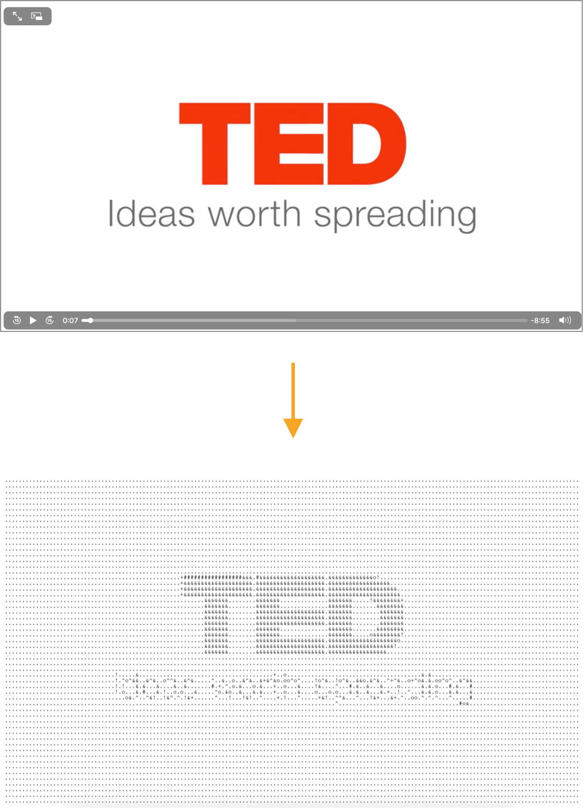

<!-- # 视频转字符画 -->

### 什么是字符画
>字符画，一种由字母、标点、汉字或其他字符组成的图画。简单的字符画是利用字符的形状代替图画的线条来构成简单的人物、事物等形象。
>摘自[百度百科](https://baike.baidu.com/item/字符画/1347002?fr=aladdin)

我的理解是，将像素点的**rgb**转化为灰度，再将**灰度值**映射到某个**字符集合**（集合不唯一，可以自己定义，只要相互的形态对比度和灰度相符合就行了）

### 目标
利用前端技术，具体说是canvas画布。实现下图的效果，将播放的视频动态的转化为对应的动态字符画。
[这里是效果预览](https://www.bilibili.com/video/av28184940)(bilibili源)


### canvas实现
1. 利用canvas从视频中**间隔取样**
2. 得到的取样（图片）信息转化为字符串
3. 字符串插入到textarea
4. 重复123步骤，即**动态字符画**

[完整的代码](https://github.com/OfficialYoungX/CodeBoard/blob/master/video2charMap.html)
主要的javascript代码（部分html和css不太重要）：
```
  // 获取video 和 canvas 的引用
    let video = document.getElementById('v');
    let canvas = document.getElementById('c');
    let textArea = document.getElementById('text-area');

    // 获取canvas 2D上下文对象
    let ctx = canvas.getContext('2d');

    let vStyleWidth;
    let vStyleHeight;

    video.onloadedmetadata = function () {
        canvas.width = video.videoWidth; // 视频宽度
        canvas.height = video.videoHeight; // 视频高度
        vStyleWidth = canvas.width;
        vStyleHeight = canvas.height;
    }

    // 根据 rgb 值得到灰度值
    let getGray = (r, g, b) => {
        return 0.299 * r + 0.578 * g + 0.114 * b; // 灰度值的浮点算法
    }

    // 灰度值映射到字符
    let mapToChar = (grayIndex) => {
        const d = 16;
        let index = Math.floor(grayIndex / d);
        const chars = ['@', 'W', '#', '$', 'O', 'E', 'X', 'C', '[', '(', '/', '?', '=', '^', '~', '_', '.', '`'];
        return chars[index];
    }

    // 填充到textarea
    let image2char = (ctx, width, height) => {
        // 获取canvas上的图像信息
        let imageData = ctx.getImageData(0, 0, width, height);
        let imageDataArr = imageData.data; // 图像信息数组
        let imgDataWidth = imageData.width; // 矩阵纬度
        let imgDataHeight = imageData.height;
        let innerContext = '';
        let p = document.createElement('p');
        for (let h = 0; h < imgDataHeight; h += 10) {
            for (let w = 0; w < imgDataWidth; w += 6) {
                let index = (w + imgDataWidth * h) * 4; // r b g a = 4个宽度
                let r = imageDataArr[index + 0];
                let g = imageDataArr[index + 1];
                let b = imageDataArr[index + 2];
                const gray = getGray(r, g, b); // 得到灰度值
                innerContext += `${mapToChar(gray)}`; // 灰度值映射到字符
            }
            innerContext += '\n';
        }
        textArea.value = innerContext;
    }


    let animationHook; // 暂停hook
    let draw = () => {
        animationHook = requestAnimationFrame(draw);
        // 从视频等间隔取样
        ctx.drawImage(video, 0, 0, vStyleWidth, vStyleHeight);
        // 生成的字符串输出到textarea
        image2char(ctx, vStyleWidth, vStyleHeight);
    }

    video.addEventListener('play', () => {
        draw();
    }, false);
    video.addEventListener('pause', () => {
        window.cancelAnimationFrame(animationHook);
    }, false);
    video.addEventListener('ended', () => {
        window.clearInterval(animationHook);
    }, false);
```
### 注意
1. rgb转灰度算法，又去[百度百科](https://www.baidu.com/link?url=-k-EdwWqAU35nrxnZL998OgCWcIIbdhLIxdtyIfCqvEjhctgBBtPJcgd3MGlLegNjbS-uZZ9MkT6bgWV_uiWPRa5hSO78IXg3vln6AXRDz5vrdUbuXLTbpsvdzt5PCaT&wd=&eqid=a5cc962a00270a76000000055c1f8297)
2. 注意字符集合中字符的相互的形态对比度
3. 利用Image.data获取图片的像素信息